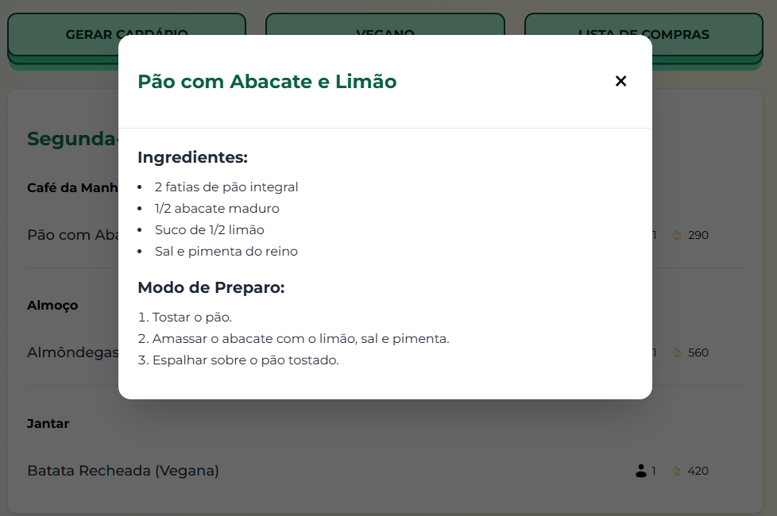
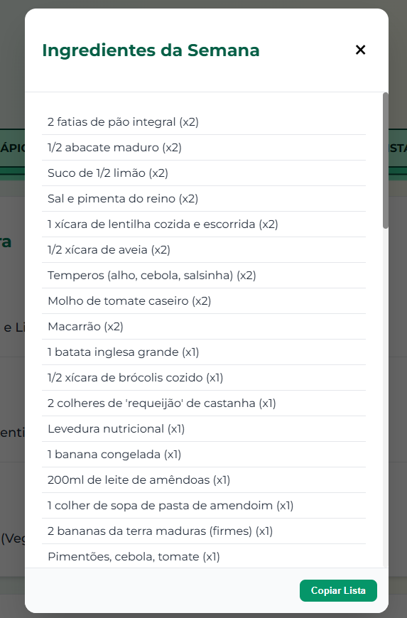
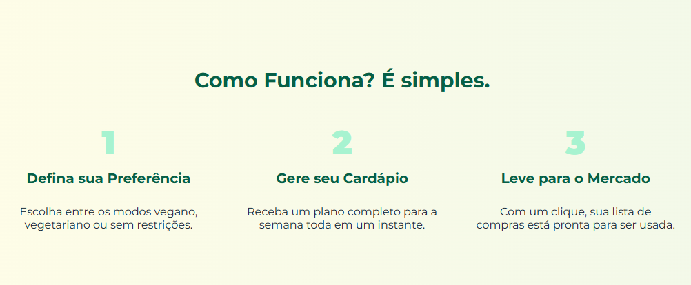

# 📅 Menu Semanal - Seu Cardápio Inteligente! 🚀

E aí, beleza? Cansado de quebrar a cabeça todo dia pensando no que cozinhar? O **Menu Semanal** nasceu pra resolver essa parada! 👊

Este projeto é um gerador de cardápios semanais simples e eficaz, construído com as tecnologias mais parrudas do front-end moderno (React, Vite, CSS Modules). O objetivo é simples: gerar um cardápio completo (café da manhã, almoço e jantar) para 7 dias, adaptado às suas preferências (sem restrição, vegetariano ou vegano), e ainda te dar a lista de compras mastigadinha.

Chega de "o que vamos comer hoje?". Bora organizar essa cozinha!


## ✨ Funcionalidades (O que essa belezinha faz)

-   **Geração Automágica:** Cria um cardápio completo (café, almoço, jantar) para 7 dias com um clique.
-   **Adaptação Total:** Escolha entre dietas **sem restrição**, **vegetarianas** ou **veganas**. O cardápio se ajusta na hora!
    
-   **Flexibilidade:** Não curtiu uma sugestão? Troque _qualquer_ refeição individualmente clicando no ícone de "reload". Chega de cardápio engessado!
-   **Detalhes da Receita:** Clique no nome de um prato para abrir um modal limpinho com os **ingredientes** e o **modo de preparo**.
    
-   **Lista de Compras Inteligente:** Gere e copie _todos_ os ingredientes da semana, já agregados, com um botão. Pronta pra levar pro mercado ou mandar no zap!
    
-   **Visual Limpo e Moderno:** Interface construída com foco na simplicidade e usabilidade, usando CSS Modules pra garantir que o estilo não vire bagunça.




## 🛠️ Tecnologias Utilizadas (O Arsenal do Chef)

A gente não usa qualquer coisa aqui, não! Só ferramenta de primeira:

-   **React (com JSX):** A base da nossa UI declarativa. Componentização na veia!
-   **Vite:** Build tool absurdamente rápido. Chega de esperar o `webpack` compilar! Performance é tudo.
-   **CSS Modules:** Estilos escopados para cada componente. Sem CSS global bagunçado, sem conflito de classe. Organização é lei!
-   **JavaScript (ES6+):** Lógica moderna e funcional, porque a gente não vive só de framework.
-   **React Router DOM:** Pra navegação entre as páginas. Um app de verdade tem rotas.


## 🚀 Como Rodar o Projeto Localmente (Bora Codar!)

Quer botar a mão na massa e ver a mágica acontecer? Segue o papo:

1.  **Clone o Repositório:**
    ```bash
    git clone https://github.com/gustavoNascimento03/Gerador-de-Menu-Semanal
    ```
2.  **Navegue até a Pasta:**
    ```bash
    cd menu-semanal
    ```
3.  **Instale as Dependências:** (Precisa ter o Node.js ou npm/yarn instalado, né?)
    ```bash
    npm install
    # ou se você for do time do Yarn:
    # yarn install
    ```
4.  **Rode o Servidor de Desenvolvimento:**
    ```bash
    npm run dev
    # ou
    # yarn dev
    ```
5.  **Acesse no Navegador:** Abra seu browser e vá para `http://localhost:5173` (ou a porta que o Vite indicar no terminal).

Pronto! O app tá rodando na sua máquina. Agora é explorar e quebrar (pra depois consertar, claro 😉).

## 👨‍💻 Autor

Feito com 💚 por Gustavo S. Nascimento !!!
